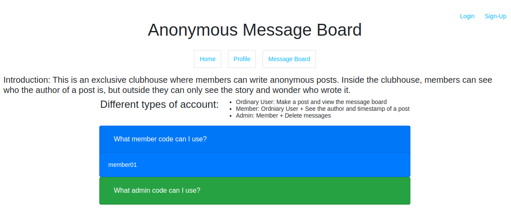
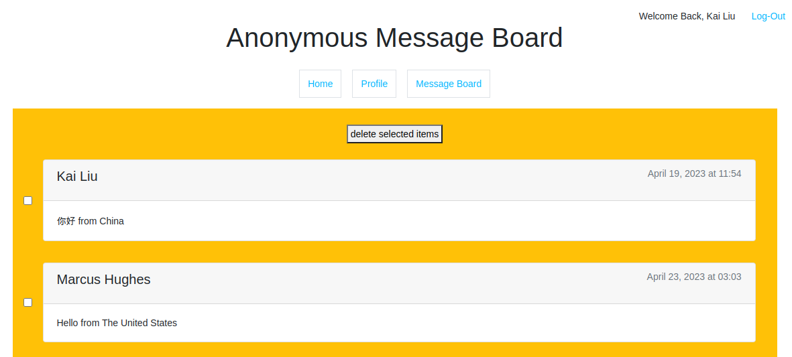

# 26.odin_members_only

[Task Description](https://www.theodinproject.com/lessons/nodejs-members-only)

[Live Preview](https://anonymous-message-board.onrender.com/)

"Members Only" is a practice that enhances my understanding of Express, authentication, and database. I use Mongoose to define data models and perform CRUD operations on MongoDB.

I learn:

1. The “POST/REDIRECT/GET” pattern can prevent user's refresh from repeating submit.
2. How to set and use cookies.
3. Why can’t I replace req.params.id with res.locals.currentUser.id: If the `/user/:id/message` route is not protected by the authentication middleware, then `req.user` will not be available, and as a result, `res.locals.currentUser` will also not be available.

Screenshots:

1. 

2. 

